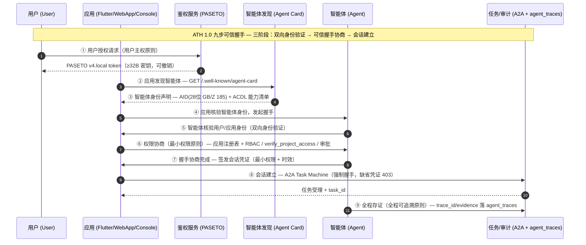

# ATH 可信互联握手能力评估 — 差距自评与报名材料

> 生成时间：2026-09-13；**校准：2026-09-22（v1.17.x，P0 整改 + 官方口径/对标骨架更新）**
> 评估依据：《互联网智能体可信互联握手能力要求》（信通院）+ ATH 1.0（2026-04-29 发起 / 2026-07-08 首批发布）
> 自检工具：`app/services/agent_governance_audit.py::run_governance_audit()`（暴露于 `GET /api/admin/agent-governance-audit`）
> 状态：内建自检通过（OWASP 10/10 + ATH 5/5）；两处 P0 差距已于 2026-09-22 整改（见 §1.1）
> **诚实边界**：「5/5」是控制点存在性自检，**不等于**信通院正式评估通过；官方「九步」逐条条款未公开，本文件九步映射为按官方三阶段 + 6 理念重构（见 §五），正式材料须以标准原文为准。

---

## 一、执行摘要

| 自检框架 | 结果 | 说明 |
|---|---|---|
| OWASP Agentic Skills Top 10 (2026) | **10/10 pass**（0 warn / 0 fail） | 提示注入、过度自主、输出处理、供应链、A2A 通信、资源约束、越权、幻觉输入、信息泄漏、IO 校验全部落地 |
| ATH/国标信任层 | **5/5 pass**（0 warn / 0 fail） | 身份声明、握手状态机、证据链、可验证意图、MCP 对齐全部落地 |

### 1.1 2026-09-22 P0 整改（本轮）

| 差距 | 整改 | 回滚开关 |
|---|---|---|
| **P0-①** 握手凭证「可选携带、缺省放行」，不符 ATH「双向身份验证」强制语义 | A2A `send_task` **强制握手**：`agent_handshake_required=True`（默认）时缺省凭证 **403 拒绝**（不再兼容放行），evidence 状态机新增 `required_missing` | 置 `agent_handshake_required=False`（改 `.env` 即可，无需回滚代码） |
| **P0-②** 应用侧 `app_id` 由调用方在请求体自报，可伪造 | 新增**应用注册表** `agent_handshake.REGISTERED_APPS`（app_id + scope 白名单）：未登记 app / 越权 scope 在签发端点 **400 拒签**；退登记 app 的存量凭证校验时拒绝（`app_unregistered`） | 同上（`required=False` 时 A2A 下发恢复旧放行路径） |

**核心结论**：项目已具备 ATH 评估的技术底座，主要工作**不在改代码，而在「把既有能力转译成标准条款对标证据 + 补齐握手流程/应用身份的显式说明」**。两处 P0 已闭环，剩余为架构形态差异与材料层差距（见 §四）。

**诚实边界**：5/5 为控制点存在性自检，不等于信通院正式评估通过。相对信通院「身份核验 / 握手交互 / 安全管控」三维度 + 九步握手 + 6 项理念，仍存在架构差异（见 §四.2）。

---

## 二、官方口径（2026-07 公开，可核验）

| 项 | 官方表述 |
|---|---|
| 发起 | 2026-04-29 中国信通院联合行业企业发起智能体可信握手协议 **ATH 1.0**（Agent Trust Handshake protocol） |
| 首批结果 | 2026-07-08 中国互联网大会智能体互联网论坛发布：**13 家企业**通过 ATH 能力评估；**ATH 2.0 共建计划同步启动**（面向大规模多方可信协作） |
| 评估依据 | 《互联网智能体可信互联握手能力要求》标准 |
| **三大核心治理维度** | **身份核验 / 握手交互 / 安全管控**（聚焦身份可信、授权可控、交互可溯） |
| **设计理念（6 项）** | 用户主权、**三方参与**（用户·智能体·应用）、可信握手、**去中心化**、最小权限、全程可追溯 |
| 九步握手 | 用户 / 智能体 / 应用三个独立角色，九步流程涵盖双向身份验证 → 可信握手协商 → 会话建立 |
| 同批其他评估线 | 互联网智能体可信评估登记清单（首批 24 个，依《可信互联网智能体能力评估规范》）；智能体互联网系列首批评估共 51 个项目，含智能体网关类 / 编排类 / 观测类 / **Claw 类** / **ATH 应用类** |
| 相邻标准 | 中国互联网协会 T/ISC 0107—2026《智能体信任评估实施指南》（技术可信 / 行为可信 / 效能可信三维度）；GB/Z 185.1~185.5 智能体互联系列；网安标委《智能体交互安全要求》（征求意见稿 v0.23—202607，要求双向身份鉴别 + 交互彼此智能体描述/安全策略/数据需求并达成调用约定） |

> 来源：中新网（2026-07-14）、经济日报（2026-07-18）、中国互联网协会（2026-07-09）。

---

## 三、ATH 对标骨架（官方三维度 × 本项目控制点）

### 3.1 三大治理维度

| 官方维度 | 官方关切 | 本项目控制点 | 证据 | 状态 |
|---|---|---|---|---|
| **身份核验** | 身份可信：用户 / 智能体 / 应用三方身份可核验 | 用户 PASETO v4.local（可撤销、Redis 化撤销列表）；智能体 AID(28 位, GB/Z 185) + ACDL 身份卡 + Agent Card 公开发现；**应用侧 `REGISTERED_APPS` 注册表（app_id + scope 白名单）** | `app/auth.py` / `app/services/agent_identity_card.py` / `agent_handshake.REGISTERED_APPS` | ✅ |
| **握手交互** | 双向身份验证 + 握手协商 + 会话建立 | ④ 应用核验智能体身份（`verify_agent_identity`）/ ⑤ 智能体核验应用身份（`verify_handshake_credential`）/ ⑦ 凭证签发（HMAC-SHA256，TTL 600s）+ **A2A `send_task` 强制握手（缺省 403）** + Task Machine 会话状态机 | `app/services/agent_handshake.py` + `POST /api/agents/handshake/{issue,verify,verify-agent}` + `app/api/a2a.py` | ✅（中心化签发，见 §4.2） |
| **安全管控** | 最小权限、授权可控、行为可追溯 | RBAC `verify_project_access`（43 个 API 文件）+ 工具 `required` 契约 + 执行前参数校验 + 凭证 scope 白名单与 `a2a:*` 域校验 + 三档 security posture + 高危工具审批状态机 + MCP 加固 | `app/rbac.py` / `app/services/agent_governance_audit.py` | ✅ |

### 3.2 六项设计理念

| 理念 | 本项目落地 | 状态 |
|---|---|---|
| 用户主权 | PASETO v4.local；用户 ID 显式入握手凭证 payload（`actor_user_id`），非仅会话态 | ✅ |
| 三方参与 | 用户（PASETO）/ 智能体（AID + ACDL）/ 应用（`REGISTERED_APPS` 白名单）三方显式建模 | ⚠️ 应用侧为**白名单校验**，非独立强身份源（无证书/来源绑定），见 §4.2 |
| 可信握手 | 九步中 ④⑤⑦ 显式实现；`send_task` 强制握手，缺省凭证 403 | ✅ |
| 去中心化 | **未实现**：模块化单体 + 中心化 HMAC 签发；`agent_handshake.py` 文档字符串已如实标注 | ❌ 架构差异 |
| 最小权限 | 凭证 scope 白名单（精确匹配）+ `a2a:*` 域校验 + `cache_user_isolation_strict` + 管理工具 `category="admin"` 隐藏 | ✅ |
| 全程可追溯 | `agent_traces`（`tool_calls` 可回放）+ `a2a_tasks.trace_id/evidence`（含 `handshake` 校验状态） | ✅ |

### 3.3 评估线选择建议

| 评估线 | 适配度 | 说明 |
|---|---|---|
| **ATH 应用类** | 高（主投） | 三维度控制点齐备；中心化架构差异需在材料中诚实标注 |
| Claw 类 | 中 | 需补运行沙盒 / 技能分发等 Claw 专项能力 |
| 可信评估登记（首批 24 个清单） | 中 | 依《可信互联网智能体能力评估规范》，可与 ATH 并行申报 |
| 智能体运行沙盒 | 低（暂不投） | 无隔离沙盒实现，转投易被判不满足 |

---

## 四、ATH 差距自评

### 4.1 内建自检（实测通过）

| 项 | 状态 | 实测证据 |
|---|---|---|
| ATH1 智能体身份可信声明 | ✅ pass | `a2a_enabled=True` + `/.well-known/agent-card` 公开发现 + **23 执行型 Agent** 清单 + 应用侧核验（`verify_agent_identity`，ATH ④）+ 应用注册表 `REGISTERED_APPS` |
| ATH2 握手互认与任务状态机 | ✅ pass | A2A Task Machine（submitted→working→completed/failed）+ 24h TTL 过期清理 + 握手凭证签发/校验（ATH ⑤⑦）+ **强制握手**（`agent_handshake_required=True`，缺省 403） |
| ATH3 执行证据链可回放 | ✅ pass | `agent_trace_persist_enabled=True` + `a2a_tasks.trace_id/evidence` + `agent_traces.tool_calls` 落库 |
| ATH4 动作可验证意图 | ✅ pass | `agent_payment_intent_enabled=True`（HMAC-SHA256 意图 token，TTL 600s；escrow 买家付款端点已绑定校验；**仅验证不扣款**） |
| ATH5 MCP 规范对齐 | ✅ pass | `app/mcp/` 对齐 2026-07-28 规范 8 项 + `mcp_security_hardening_enabled=True` |

OWASP 10 项对照详见 `app/services/agent_governance_audit.py::run_governance_audit`，全部 `pass`。

### 4.2 真实差距（相对信通院正式评估）

| 差距 | 现状 | 整改建议 |
|---|---|---|
| **中心化签发 vs ATH 去中心化原则** | 握手凭证由平台 HMAC 中心化签发，仅对齐握手凭证语义（最小权限 + 时效 + 防篡改） | 材料中诚实标注架构形态，不伪装分布式（符合诚实降级红线） |
| **应用侧身份为白名单而非强身份源** | `REGISTERED_APPS` 校验 app_id + scope，但不校验「该请求确实来自该应用」（无 mTLS / Origin / 密钥对绑定） | 跨主体对接时补应用密钥对或合作伙伴 API Key 绑定（P1） |
| **九步握手未作为原生协议显式实现** | 当前是「凭证服务 + A2A Task Machine」的等价实现，非独立 ATH 握手协商报文字段 | 材料附九步映射时序图（§五），或诚实标注为「A2A 等价实现」 |
| **安全管控维度缺「运行沙盒」映射** | 有 MCP 加固 + 审批状态机，但「运行沙盒」是信通院另一独立标准 | 暂不投沙盒评估线；材料中说明沙盒不适用（§3.3） |
| **ATH 2.0 多方可信协作未覆盖** | 无大规模多方（>2 参与方）协作与跨主体信任传递 | 关注 ATH 2.0 配套标准发布后再迭代 |
| **材料层差距** | 能力全在代码 / flag 层面，缺「标准条款逐条对标证据文档」 | 取得标准原文后按 §六 大纲补齐对标证据表 |

---

## 五、ATH 九步可信握手时序图

> 说明：信通院 ATH 1.0 官方「九步」未逐条公开。以下时序图为**按 ATH 1.0 三阶段（双向身份验证 → 可信握手协商 → 会话建立）+ 6 项理念重构的映射时序**，并将每一步标注项目现有实现，供对标材料使用（非宣称已原生实现 ATH 握手协议）。

### 九步现状对照表

| 步 | ATH 环节 | 项目现状 | 证据 / 实现 |
|---|---|---|---|
| ① | 用户授权请求（用户主权） | ✅ 已具备 | `app/auth.py::get_current_user` PASETO v4.local |
| ② | 应用发现智能体 | ✅ 已具备 | `GET /.well-known/agent-card` 公开端点 |
| ③ | 智能体身份声明 | ✅ 已具备 | `app/services/agent_identity_card.py` AID(28位) + ACDL |
| ④ | 应用核验智能体身份 | ✅ 已实现（2026-09-13） | `agent_handshake.verify_agent_identity` + `POST /api/agents/handshake/verify-agent`（AID 逐位 compare_digest 比对） |
| ⑤ | 智能体核验应用/用户身份（双向） | ✅ 已实现（2026-09-13） | `agent_handshake.verify_handshake_credential` + `POST /api/agents/handshake/verify`（app/agent/actor 三方字段逐项比对 + 应用注册表） |
| ⑥ | 权限协商（最小权限） | ✅ 已具备 | 应用注册表 scope 白名单 + `verify_project_access`（43 个 API 文件）+ RBAC + 审批状态机 |
| ⑦ | 握手协商签发凭证 | ✅ 已实现（2026-09-13） | `agent_handshake.create_handshake_credential` + `POST /api/agents/handshake/issue`（HMAC-SHA256 复用 PASETO 主密钥，TTL 600s，payload=app_id\|agent\|actor\|scope\|exp；未登记 app / 越权 scope 400 拒签） |
| ⑧ | 会话建立 + 任务状态机 | ✅ 已具备 + **强制握手** | A2A Task Machine（`app/api/a2a.py`）：`agent_handshake_required=True` 时缺省凭证 403 |
| ⑨ | 全程存证可追溯 | ✅ 已具备 | `a2a_tasks.trace_id/evidence`（含 `handshake=verified/absent/gate_disabled`）+ `agent_traces` 回放 |

**九步全部 ✅（④⑤⑦ 于 2026-09-13 补齐；⑧ 于 2026-09-22 改为强制握手）**。

### 剩余差距（诚实标注）

| 差距 | 说明 |
|---|---|
| **中心化签发 vs 去中心化原则** | 握手凭证由平台 HMAC 中心化签发，对齐握手凭证语义（最小权限 + 时效 + 防篡改），但**非** ATH「去中心化/分布式认证」的完整实现，禁止对外宣称为去中心化。 |
| **应用身份为白名单校验** | `REGISTERED_APPS` 阻断「自报任意 app_id」，但不验证请求确实来自该应用（无密钥对/来源绑定）；跨主体对接须补强（P1）。 |
| **运行沙盒未映射** | 「运行沙盒」是信通院另一独立标准，本平台未实现隔离沙盒，不投该评估线。 |
| **跨主体凭证分发未实现** | 握手凭证与 PASETO 会话鉴权并行，尚未实现对端（如索克生活）的带外凭证分发；`docs/suoke-a2a-alignment-plan.md` 已规划（`app_id="suoke_life"` 已登记）。 |

---

## 六、ATH 报名材料大纲

### 1. 企业与产品资质
- 营业执照、企业简介（对应「信息技术企业 / 智能体平台运营方」身份）
- 产品/服务定位、部署形态（阿里云 ECS + 模块化单体 + Flutter 多端 + React 控制台）
- 产品架构图：智能体运行时 → 编排层 → MCP/A2A → 数据层

### 2. 身份核验维度（对应 ATH1 + 三方参与）
- 鉴权方案：PASETO v4.local、密钥管理、撤销列表 Redis 化
- 用户/智能体/应用三方身份标识与互认机制（含**应用注册表**说明 + 三方握手时序图）
- 会话加密（`allow_plaintext_session=False`）+ Agent Card 公开发现 + AID/ACDL 身份卡

### 3. 安全管控维度（对应最小权限 + 授权可控）
- 权限模型：RBAC `verify_project_access`（实测覆盖 43 个 API 文件）、工具 `required` 契约 + 执行前参数校验
- 最小权限与回收：凭证 scope 白名单（越权 400 拒签）、`cache_user_isolation_strict`、管理工具 `category="admin"` 隐藏
- MCP 安全加固：描述防投毒 / SSRF 拦截 / 输出清洗
- 运行时约束：三档 security posture + 高危工具审批状态机

### 4. 交互可溯维度（对应握手交互 + 全程可追溯）
- 握手/任务状态机说明（**强制握手闸门** + A2A Task Machine + 24h TTL）
- 行为审计：`agent_traces` 落库、tool_calls 序列化回放、`a2a_tasks.trace_id/evidence` 证据链
- 可验证意图：`agent_payment_intent` HMAC 端点（诚实标注：仅验证不扣款）
- 治理审计报告：附 `run_governance_audit` 输出（OWASP 10/10 + ATH 5/5）

### 5. 技术测评辅助
- 可访问演示/测试环境、API 文档、关键接口示例
- 附「九步握手流程」显式说明或 A2A 等价实现对照表（见 §五）

---

## 七、下一步行动

1. 邮件向信通院联系人索取《互联网智能体可信互联握手能力要求》原文 + 正式材料清单：
   - 马铭洋（开源和软件安全部）mamingyang@caict.ac.cn / 18600235069
   - 卫斌（开源和软件安全部 副主任）weibin@caict.ac.cn / 18618259777
2. 将 §三、§四、§五 内容转译为信通院标准条款逐条对标证据表（待标准原文）。
3. 应用侧身份补强（P1）：跨主体对接补密钥对 / 合作伙伴 API Key 绑定，替代纯白名单校验。
4. 关注 ATH 2.0 配套标准发布，评估多方可信协作能力补齐路径。
