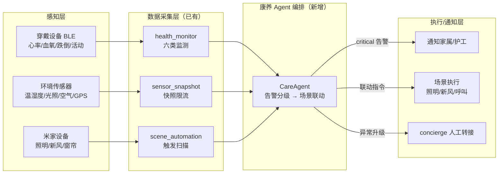

# TERA-Award 2026 智慧家庭专题赛 — 参赛方案

> 赛事主题：智联万家 · 零碳未来
> 参赛定位：主攻「家庭生活 AI 及智能体」，副打「家庭安全与用能」
> 生成时间：2026-09-13

---

## 一、赛道定位

| 赛道 | 匹配度 | 项目对应能力 |
|---|---|---|
| **家庭生活 AI 及智能体**（家庭管理/生活服务/情感陪伴） | ★★★★★ 核心赛道 | 21 执行型 Agent + 4 运营 Agent；BOM 反向驱动采购「以销定产」；Agent 自进化管线 |
| **家庭安全与用能**（智能感知/风险预警/设备管理/能源优化） | ★★★★ 副赛道 | 场景自动化、传感器快照、米家设备控制、穿戴 BLE 健康监测、Matter 凭据加密 |
| 智慧厨房 | ★★ 弱相关 | 家装含厨房设计与厨电预算，非强项 |
| 家庭服务机器人 | ★ 基本不匹配 | 无实体机器人，不建议 |

---

## 二、PPT 分镜脚本（14 页）

> 每页含：核心文案 / 视觉图表 / 数据证据锚点 / 演讲提示

### P1 封面
- **文案**：主标题「AI 智能装修管家：从设计到康养疗愈」；副标题「21+ 执行型智能体 + 可信握手（ATH）+ 场景联动」
- **视觉**：品牌 Logo + 一张「设计→康养」主视觉图
- **演讲**：30 秒 elevator pitch——「一个会设计、会施工、还会照护的家」

### P2 痛点
- **文案**：① 家装链路割裂（设计/预算/采购/施工/验收各自为政）② 康养/疗愈/旅居缺智能闭环 ③ 智能体缺信任底座
- **视觉**：三条痛点 + 对应后果的对比图
- **数据锚点**：行业家装平均决策周期、返工率、老年康养空巢数据（引用公开数据）

### P3 方案总览
- **文案**：模块化单体 + 21 执行型 Agent + 4 商业运营 Agent，覆盖「设计→预算→采购→施工→验收→结算→管家」全链路
- **视觉**：一张架构图（运行时 → 编排层 → MCP/A2A/ATH 协议层 → 数据层）
- **演讲**：一句话讲清「一个系统搞定全链路 + 康养延伸」

### P4 技术底座：可信互联（差异化壁垒）
- **文案**：A2A Agent Card + Task Machine；**ATH 九步握手 ④⑤⑦ 已实现**（应用核验智能体身份 / 智能体核验应用身份 / 握手凭证签发）
- **视觉**：九步握手时序图 + 治理审计报告截图（OWASP 10/10 + ATH 5/5）
- **数据锚点**：`agent_handshake` HMAC 握手凭证 + `verify_project_access` 覆盖 43 个 API 文件

### P5 创新 ① 以销定产（义乌模式）
- **文案**：designer BOM 反向驱动采购优先级（紧急/常规/可缓），减少无效采购与库存占用
- **视觉**：BOM → 采购优先级 实际案例流程图
- **演讲**：「以销定产」——先有方案，再定采购，不压货

### P6 创新 ② 智能体自进化
- **文案**：Case 提取 → Skill 蒸馏 → 三维质控 → 失败学习（反模式），越用越准
- **视觉**：一条「失败 → 沉淀 → 下次避开」的真实轨迹截图
- **演讲**：「不靠人工调优，靠数据自我进化」

### P7 创新 ③ 诚实降级 + 全链路证据
- **文案**：A2A `trace_id`/`evidence` 证据链，每一步可核验、可回放；无硬编码假数据
- **视觉**：A2A 任务返回含 evidence 的 JSON 截图
- **演讲**：「智能体要敢说『我不会』，而不是假装会」

### P8 场景 ① 康养（重点，已落地 CareAgent）
- **文案**：六类健康监测（睡眠/空气/跌倒/活动/心率/血氧）+ 穿戴 BLE + 环境传感器 + 米家设备；**CareAgent 告警 → 场景联动（已实现）**
- **视觉**：康养数据流图 + `evaluate_care_actions` 联动表 + 操作录屏
- **联动示例**：跌倒→起夜照明+通知家属+人工转接；心率/血氧严重异常→通知+就医建议；睡眠差→遮光/白噪音；空气差→新风联动
- **演讲**：「只监测提醒，不做医疗诊断」——诚实边界

### P9 场景 ② 旅居
- **文案**：候鸟式/异地养老/民宿度假屋；远程设计 + 远程施工监理 + 传感器快照远程监测 + 「一键到家」场景
- **视觉**：远程监测看板截图 + 一键到家场景示意
- **演讲**：「把装修交付延伸为旅居全周期托管」

### P10 场景 ③ 疗愈（中医）
- **文案**：中医理疗空间（药膳厨房/药浴卫浴/艾灸通风）+ 温湿度/空气质量场景联动
- **视觉**：中医理疗空间 3D 效果图 + 联动逻辑
- **演讲**：「科技服务传统疗愈，不是替代」

### P11 场景 ④ 疗愈（西医）
- **文案**：术后/康复空间（无障碍设计/护理床联动/环境监测/康复进度跟踪）
- **视觉**：康复空间方案 + 健康监测告警→护工通知闭环
- **演讲**：「从住院到居家康复的无缝衔接」

### P12 商业化
- **文案**：用户数/订单数/交付单量/复购率 + 营收模型（装企交付 + 康养增值 + 智能家居托管）
- **视觉**：增长曲线 + 营收构成饼图
- **数据锚点**：真实运营数据（哪怕早期也要有）

### P13 团队与组织
- **文案**：核心团队背景、分工、研发投入；已具备技术资产（专利/软著/ICP 备案/审计报告）
- **视觉**：团队照片 + 资质清单
- **演讲**：「能落地的团队，不是 PPT 团队」

### P14 结尾
- **文案**：赛道定位复述（主「家庭生活 AI 及智能体」+ 副「家庭安全与用能」）+ 合作诉求
- **视觉**：接入名气家 4600 万家庭场景验证 + 算力 Token + 资本对接
- **演讲**：联系方式 + 一句收尾

---

## 三、康养场景 Agent 设计（展开）

### 3.1 定位

**CareAgent（康养管家）**：面向适老化/康养住宅的居家健康与安全智能体，负责健康监测预警、跌倒检测告警、环境自适应联动、康养空间设计建议与家属/护工通知。

> 状态：**已落地**（v1.16.x）。数据采集层（health_monitor / sensor_snapshot / scene_automation / wearable BLE）+ CareAgent 编排逻辑（`app/agents/care.py`）均已实现，见 §3.4。

### 3.2 数据流

### 3.3 现有可复用能力（数据采集层已具备）

| 能力 | 类型 | 实现位置 |
|---|---|---|
| 心率 / 血氧 / 跌倒 / 活动 / 睡眠 / 空气 六类健康监测 | `health_monitor` | `app/schemas/health_monitor.py`（`monitor_type` 枚举 + `value` 必需键校验） |
| 环境快照（温湿度/光照/空气质量/GPS，范围校验） | `sensor_snapshot` | `app/api/sensor_snapshot.py`（`SensorSnapshotRequest` 数值范围约束） |
| 穿戴 BLE 心率（0x180D/0x2A37）、电量、跌倒 | 穿戴接入 | `flutter_app/lib/pages/wearable_devices_page.dart` + `wearable_ble_service` |
| 场景自动化触发（sensor 触发 + per-device 锁） | `scene_automation` | `app/services/scene_automation_service.py` |
| 米家设备控制（云清单/局域网状态/动作） | `MijiaBridge` | `app/services/`（`python-miio`） |
| 健康告警分级（normal/warning/critical） | `alert_level` | `HealthMonitorCreate` |

### 3.4 编排逻辑（已落地，`CareAgent.evaluate_care_actions`）

| 触发条件 | 编排动作 | 告警级别 |
|---|---|---|
| `fall_detection.fall_detected=True` | 起夜照明 + 通知家属/护工 + 呼叫，超时未确认转 concierge 人工 | critical |
| `heart_rate.bpm` 越界（如 <40 或 >150） | 通知 + 记录，连续异常触发紧急联系 | critical |
| `spo2.spo2` 低于阈值（如 <90） | 通知 + 建议就医（不诊断） | critical |
| `sleep_quality.sleep_score` 低 | 环境自适应：调整遮光/白噪音/温湿度 | warning |
| `air_quality`（AQI 差 / 甲醛超标） | 联动新风/净化器 | warning |
| `activity_tracking.steps` 长期为 0 | 提示久坐/异常，通知护工确认 | warning |

### 3.5 Agent 定义（ACDL 对齐）

| 字段 | 值 | 说明 |
|---|---|---|
| `agent_name` | `care` | 延续 designer(01)…concierge(07) 之后 |
| `type_code` | `08` | `AGENT_TYPE_CODES` 新增条目 |
| `security_level` | `L3` | 涉及健康 PII，高于普通 L2 |
| `capabilities` | 健康监测预警 / 跌倒检测告警 / 环境自适应联动 / 康养空间设计建议 / 家属护工通知 | ACDL 能力描述 |

### 3.6 与其他 Agent 协作

| 协作对象 | 职责 |
|---|---|
| `DesignerAgent` | 适老化/康养空间设计（无障碍、扶手、护理动线、防滑） |
| `ConstructionAgent` | 适老化改造施工与进度跟踪 |
| `QAInspectorAgent` | 适老化/无障碍验收 |
| `ConciergeAgent` | 健康异常 → 家属/护工通知、人工转接 |

### 3.7 安全与诚实降级边界

- **PII 保护**：健康数据走 `pii_masking` + 会话 Fernet 加密（`allow_plaintext_session=False`）。
- **告警分级**：`normal / warning / critical` 三级，避免误报打扰。
- **诚实边界**：仅做**监测与提醒**，不做医疗诊断/处方，不伪装医疗能力（符合诚实降级红线）。
- **数据归属**：所有健康数据按 `user_id` 隔离，读写前 `verify_project_access` 项目归属校验。

---

## 四、旅居 / 疗愈场景简述

### 4.1 旅居（候鸟式/异地养老/民宿度假屋）
- 远程设计（designer）+ 远程施工监理（construction）+ 传感器快照远程监测（sensor_snapshot）
- 「一键到家」场景：异地归家自动恢复温湿度/照明/安防
- 差异化：把「装修交付」延伸为「旅居全周期托管」

### 4.2 疗愈（中医）
- 中医理疗空间设计：药膳厨房、药浴卫浴、艾灸通风
- 温湿度/空气质量场景联动（`air_quality` + `scene_automation`）

### 4.3 疗愈（西医）
- 术后/康复空间：无障碍设计、护理床联动、环境监测（温湿度/光照/空气质量）、康复进度跟踪

---

## 五、准备清单

1. **参赛硬门槛核对**：确认「拥有专利权的原型 + 已进入早期商业化」；若无专利先补软著/专利或选已有专利技术点申报。
2. **材料规格**（参考 TERA-Award 主赛事）：项目说明 PPT（含演示视频）、英文 Abstract ≤100 字、上传不多于 3 个 zip（每个 <190MB）。
3. **演示视频**：真实 App/WebApp 操作录屏（智能体对话、预算生成、施工进度、康养健康联动）。
4. **量化商业证据**：用户数/订单数/交付单量/复购。
5. **团队组织力材料**：核心团队背景、分工、研发投入。
6. **联系确认**：建议先联系名气家/云港智三生确认专题赛专属评审口径与康养赛道细项。
